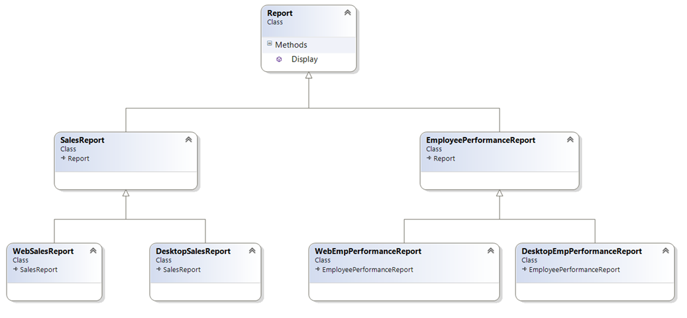
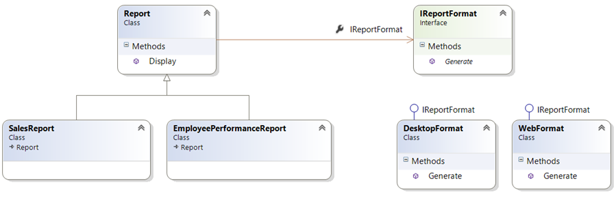

# Bridge Design Pattern

_Structed_ - Yapısal Tasarım Deseni.

Soyutlanmış(abstract) bir yapıyı, implementasyondan ayırarak bağımsız olarak genişletilebilir iki yapı elde etmemizi sağlar.

Aşağıdaki örnekte senaryo: Web ve Desktop formatlarında Satışların ve Çalışanların Performans raporları olması.

\
&nbsp;
\
&nbsp;

Bu modelde DesktopSalesReport ile WebEmpPerformanceReport aynı atadan türüyor fakat bu iki yapı birbirinden bambaşka şeyler.Bu classların geliştilirebilir yapıda olması için bağlarının olmaması gerekli.

Report bu modelde soyutlaştırılmış bir yapıdır.Yani satış veya çalışan performansı raporu oluştururken hangi formatta(Desktop veya Web) kaydetmesini söylememiz yeterli olacak. Bu durum için bir interface oluşturuyoruz ve aşağıdaki yapıya kavuşuyoruz.

\
&nbsp;
\
&nbsp;

\
&nbsp;

\
&nbsp;

\
&nbsp;

\
&nbsp;

#### Kaynaklar:

[Turkayurkmez](https://www.turkayurkmez.com/bridge-design-pattern/)

\
&nbsp;
[Mshowto](https://www.mshowto.org/bridge-tasarim-deseni-nedir.html)
